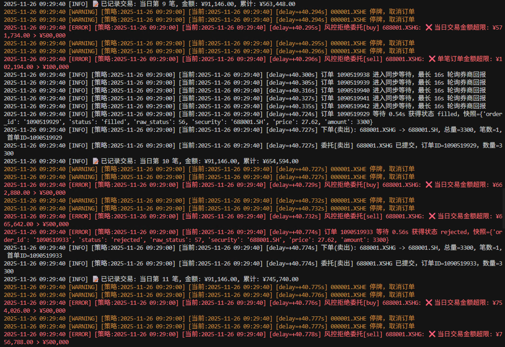

# 实盘引擎

本页涵盖本地 QMT/模拟与远程 qmt-remote 两种运行方式，聚焦最小可用流程与关键截图。

## 生命周期流程

```
┌─────────────────────────────────────────────────────────────────────────────┐
│  bullet-trade live strategy.py --broker qmt                                 │
└───────────────────────────────────┬─────────────────────────────────────────┘
                                    │
                                    ▼
┌─────────────────────────────────────────────────────────────────────────────┐
│  1. 启动阶段                                                                  │
│                                                                              │
│     ┌──────────────┐    ┌──────────────┐     ┌──────────────┐                │
│     │ 加载策略文件   │  → │ 检查运行态     │  →  │ 首次启动?     │                │
│     │ strategy.py  │    │ g.pkl 存在?   │     │              │                │
│     └──────────────┘    └──────────────┘     └──────┬───────┘                │
│                                                     │                        │
│                              ┌──────────────────────┴─────────────────────┐  │
│                              │                                            │  │
│                              ▼                                            ▼  │
│                    ┌──────────────────┐                     ┌──────────────┐ │
│                    │ 是：调用          │                     │ 否：恢复状态   │ │
│                    │ initialize()     │                     │ 跳过init     │ │
│                    └────────┬─────────┘                     └──────┬───────┘ │
│                              │                                      │        │
│                              └──────────────┬───────────────────────┘        │
│                                             ▼                                │
│                              ┌──────────────────────────┐                    │
│                              │ 代码变更?                 │                    │
│                              │ (hash对比)               │                    │
│                              └────────────┬─────────────┘                    │
│                                           │ 是                               │
│                                           ▼                                  │
│                              ┌──────────────────────────┐                    │
│                              │ after_code_changed()     │                    │
│                              │ 热更新回调                 │                    │
│                              └────────────┬─────────────┘                    │
│                                           ▼                                  │
│                    ┌──────────────┐    ┌──────────────┐                      │
│                    │ 初始化券商     │  → │process_      │                      │
│                    │ Broker连接    │    │initialize()  │                      │
│                    └──────────────┘    └──────────────┘                      │
├─────────────────────────────────────────────────────────────────────────────┤
│  2. 运行循环（持续运行，每日重复）                                            │
│                                                                              │
│     ┌───────────────────────────────────────────────────────────────────┐   │
│     │  每个交易日                                                         │   │
│     │                                                                   │   │
│     │  09:15 ─────────────────────────────────────────────────────────  │   │
│     │    │                                                              │   │
│     │    ▼  before_trading_start()  盘前准备                             │   │
│     │                                                                   │   │
│     │  09:30 ─────────────────────────────────────────────────────────  │   │
│     │    │                                                              │   │
│     │    ▼  MarketOpenEvent 开盘事件                                     │   │
│     │    │  run_daily 定时任务开始执行                                    │   │
│     │    │  handle_data() / handle_tick() 触发                          │   │
│     │    │                                                              │   │
│     │  11:30 ─────────────────────────────────────────────────────────  │   │
│     │    │  午休（自动跳过，不触发回调）                                     │   │
│     │  13:00 ─────────────────────────────────────────────────────────  │   │
│     │    │                                                              │   │
│     │    ▼  继续执行 run_daily 定时任务                                    │   │
│     │                                                                   │   │
│     │  15:00 ─────────────────────────────────────────────────────────  │   │
│     │    │                                                              │   │
│     │    ▼  MarketCloseEvent 收盘事件                                    │   │
│     │    │  after_trading_end()  盘后清理                                │   │
│     │    │  自动保存 g.pkl / live_state.json                             │   │
│     │    │                                                              │   │
│     │  ────────── 等待下一个交易日 ──────────                              │   │
│     └───────────────────────────────────────────────────────────────────┘   │
├─────────────────────────────────────────────────────────────────────────────┤
│  3. 退出阶段                                                                 │
│     ┌──────────────┐    ┌──────────────┐    ┌──────────────┐                │
│     │ Ctrl+C 终止   │ →  │ 保存运行态     │ →  │ 断开券商连接  │                │
│     │ 或异常退出     │    │ g.pkl        │    │ 清理资源      │                │
│     └──────────────┘    └──────────────┘    └──────────────┘                │
└─────────────────────────────────────────────────────────────────────────────┘
```

## 生命周期回调说明

| 回调函数 | 触发时机 | 典型用途 |
|----------|----------|----------|
| `initialize(context)` | 首次启动时调用（运行态不存在） | 初始化策略参数、注册定时任务 |
| `process_initialize(context)` | 每次进程启动后调用 | 恢复连接、重建缓存、检查状态 |
| `after_code_changed(context)` | 检测到策略文件变更后调用 | 热更新逻辑、参数调整 |
| `before_trading_start(context)` | 每日开盘前（09:15）调用 | 盘前数据准备、选股 |
| `handle_data(context, data)` | 开盘时（09:30）调用一次 | 日级别交易逻辑 |
| `handle_tick(context, tick)` | 收到 tick 推送时调用 | tick 级别交易逻辑 |
| `after_trading_end(context)` | 每日收盘后（15:00）调用 | 盘后统计、发送通知 |

## 典型交易日时间线

```
时间        事件                              说明
────────────────────────────────────────────────────────────────────────────
08:00       LiveEngine 启动                   加载策略、恢复 g 状态
            ↓
09:15       BeforeTradingStartEvent           触发 before_trading_start()
            before_trading_start()            盘前选股、数据准备
            ↓
09:25       集合竞价结束                       可获取开盘价
            ↓
09:30       MarketOpenEvent                   正式开盘
            run_daily('09:30') 任务执行       定时任务触发
            handle_data() 触发                日级别交易逻辑
            ↓
09:30-11:30 盘中交易时段                      run_daily 任务按时触发
            handle_tick() 持续触发            tick 推送
            订单实时处理                      委托、成交、撤单
            ↓
11:30-13:00 午休                             自动跳过，不触发任何回调
            ↓
13:00-15:00 下午交易时段                      与上午相同
            ↓
15:00       MarketCloseEvent                 收盘
            after_trading_end()              盘后统计、通知
            自动保存 g.pkl                   持久化策略状态
            ↓
15:00+      收盘后                           等待下一个交易日
            可选：继续运行或退出
```

## 场景对比（先选路径）

| 场景 | 命令 | 必填变量 | 适合谁 |
| --- | --- | --- | --- |
| 本地 QMT | `bullet-trade live ... --broker qmt` | `QMT_DATA_PATH`、`QMT_ACCOUNT_ID` | 已安装 QMT/xtquant，想直接盯盘 |
| 模拟券商 | `--broker simulator` | 无 | 风控演练/联调 |
| 远程 qmt-remote | `--broker qmt-remote` | `QMT_SERVER_HOST/PORT/TOKEN` | 云/局域网托管，策略在本地 |

> 更多变量说明见 [配置总览](config.md)。

## 本地 QMT / 模拟最小步骤

```bash
cp env.live.example .env
# 核心变量（其余看 config.md）
DEFAULT_BROKER=qmt          # 或 simulator
QMT_DATA_PATH=C:\国金QMT交易端\userdata_mini
QMT_ACCOUNT_ID=123456
LOG_DIR=logs
RUNTIME_DIR=runtime

bullet-trade live strategies/demo_strategy.py --broker qmt
```
- 建议先用 `--broker simulator` dry-run，再切换真实账号。

### 命令行参数

```bash
bullet-trade live [-h] strategy_file --broker {qmt,qmt-remote,simulator}
                  [--log-dir LOG_DIR] [--runtime-dir RUNTIME_DIR]
```

| 参数 | 必填 | 说明 |
|------|------|------|
| `strategy_file` | ✓ | 策略文件路径 |
| `--broker` | ✓ | 券商类型：`qmt`、`qmt-remote`、`simulator` |
| `--log-dir` | | 日志目录（覆盖 .env 中的 LOG_DIR） |
| `--runtime-dir` | | 运行态目录（覆盖 .env 中的 RUNTIME_DIR） |

### 实盘效果与日志

QMT 本机持仓/下单：


委托状态（限价/市价/撤单）：


同步下单日志（16s 队列 vs 0.5s 成交示例）：


运行态持久化目录（`live_state.json`、`g.pkl`）：


## 远程实盘（qmt-remote）

1) 远程 Windows 主机启动（需放行防火墙）：
```bash
bullet-trade server --listen 0.0.0.0 --port 58620 --token secret \
  --enable-data --enable-broker \
  --accounts main=123456:stock
```
首次启动会弹防火墙，请选择放行：


2) 本地 `.env`：
```bash
DEFAULT_BROKER=qmt-remote
QMT_SERVER_HOST=10.0.0.8
QMT_SERVER_PORT=58620
QMT_SERVER_TOKEN=secret
QMT_SERVER_ACCOUNT_KEY=main
```

3) 运行策略：
```bash
bullet-trade live strategies/demo_strategy.py --broker qmt-remote
```

4) 服务端日志示例：


## 状态持久化

实盘引擎自动管理运行态，支持断点续跑：

```
runtime/
├── live_state.json    # 引擎状态（当前日期、已执行任务等）
└── g.pkl              # 策略全局变量 g 的序列化
```

### 持久化机制

| 时机 | 保存内容 |
|------|----------|
| 每日收盘后 | 自动保存 `g.pkl` 和 `live_state.json` |
| 定时自动保存 | 可配置间隔（`G_AUTOSAVE_INTERVAL`） |
| 进程退出时 | 保存当前状态 |

### 状态恢复

重启后，引擎会：
1. 检测 `g.pkl` 是否存在
2. 存在则恢复 `g` 状态，跳过 `initialize()`
3. 调用 `process_initialize()` 让策略处理恢复逻辑
4. 对比策略文件 hash，变更则调用 `after_code_changed()`

## 安全与风控

- `.env` 不入库；远程服务务必带 `--token`，必要时限制到内网。
- 策略层保留风控钩子：停牌过滤、最大回撤、成交失败重试等。
- QMT server 更多参数见 [QMT server](qmt-server.md)。
- 若要让聚宽模拟盘接入远程实盘，请看 [trade-support](trade-support.md)。

### 风控参数配置（.env）

| 变量 | 默认值 | 作用 |
| --- | --- | --- |
| `MAX_ORDER_VALUE` | `100000` | 单笔订单金额上限，超过即拒单。 |
| `MAX_DAILY_TRADE_VALUE` | `500000` | 单日累计成交金额上限，超过即拒单。 |
| `MAX_DAILY_TRADES` | `100` | 单日最大交易笔数，超过即拒单。 |
| `MAX_STOCK_COUNT` | `20` | 持仓标的数上限（仅买入检查）。 |
| `MAX_POSITION_RATIO` | `20` | 单标下单金额占总资产的最大比例。 |
| `STOP_LOSS_RATIO` | `5` | 止损阈值，仅供 `check_stop_loss` 辅助判断。 |
| `RISK_CHECK_ENABLED` | `false` | 开启后台风控巡检。 |

> 提示：默认值偏宽，真实账户请按资金量收紧；先用 `LIVE_MODE=dry_run` 验证风控配置，再切 `LIVE_MODE=live`。

实盘风控情况：


## 常见问题

### 策略重启后状态丢失

检查 `RUNTIME_DIR` 配置是否正确，确保指向持久化目录。

### 定时任务没有触发

1. 检查 `run_daily` 的时间格式是否正确（如 `'10:00'`）
2. 确认当前是交易时段
3. 查看日志中是否有调度相关错误

### 订单没有成交

1. 检查 QMT 客户端是否正常登录
2. 查看风控日志是否拒单
3. 确认标的是否停牌或涨跌停

### 远程连接失败

1. 检查防火墙是否放行端口
2. 确认 `QMT_SERVER_HOST` 和 `QMT_SERVER_PORT` 配置正确
3. 验证 `QMT_SERVER_TOKEN` 与服务端一致
